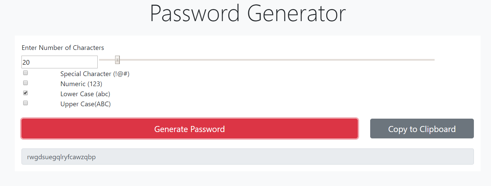

# password

This simple password generator allows the user to input the number of character (via the text box or slider) and select the content of the password.

It takes 4 different arguments for the password content (lower case, upper case, Special characters).

If the user fails to set the proper content the program throws a corresponding error.

Once all the content has been selected the user can click the "Generate password" button to generate the password and display it in the text box.

The user may then copy the password manually or click the "Copy to Clipboard" button to automatically copy the password.

